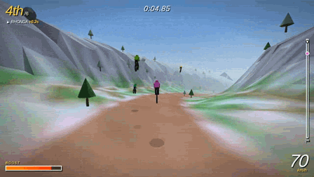

# 🚵 DOWNHILL MAYHEM

A **free, browser-playable, fan-made tribute** to *Downhill Domination* (PS2, 2003) —
one long point-to-point race down a mountain against 5 AI rivals, with mid-air tricks
that charge a boost meter and fists (and boots) that settle position disputes.

  
   
  <b><a href="https://pranshuparmar.github.io/downhill-mayhem/">▶ PLAY NOW — free, in your browser</a></b>

> Fan-made tribute. **Not affiliated with Sony** or the original developers.
> No original game assets are used: every model is built from Three.js primitives,
> every texture is canvas-generated, and every sound is synthesized at runtime with
> the Web Audio API.

## Play it

- **In your browser (desktop or phone):** [pranshuparmar.github.io/downhill-mayhem](https://pranshuparmar.github.io/downhill-mayhem/)
- **On itch.io:** [pranshuparmar.itch.io/downhill-mayhem](https://pranshuparmar.itch.io/downhill-mayhem)
- **Locally:** just double-click `index.html`. Fully offline — nothing is fetched from
  anywhere, ever.

📱 On phones and tablets, touch controls appear automatically: steer and brake with the
left thumb; jump, tricks, punch/kick and boost with the right. Pedalling is automatic,
boost is tap-to-toggle, and the game asks you to rotate to landscape. The top button
row covers the PB ghost (👻), mute, restart, home and fullscreen.

The whole game is a single self-contained `index.html` — three.js included inside it —
no build step, no npm, no server, no network.

## Controls

| Input | Action |
|---|---|
| `↑` / `W` | Pedal |
| `↓` / `S` | Brake — or **Backflip** while airborne |
| `←` `→` / `A` `D` | Steer — hold a hard turn at speed to break into a slide |
| `Space` | Bunny hop — hop right at a ramp lip for bonus air |
| `Z` `X` `C` | Tricks while airborne: No Hander / Superman / Heel Clicker |
| `Shift` | Boost (drains the meter) |
| `E` | Punch a nearby rider off their bike — works mid-air too |
| `F` | Kick — also mid-air; landed hits pay boost, extra while airborne or boosting |
| `R` | Restart the race |
| `M` | Mute audio (music and all) |
| `T` | Toggle the CRT scanline/vignette filter |
| `G` | Toggle the ghost of your best run |

**How it plays:** the mountain does most of the accelerating — pedal out of the gate and
out of slow corners, brake before the sweepers, and hit the wooden kickers for airtime.
Start a trick in the air and *land after its bar fills* to bank boost meter; land mid-trick
and you eat dirt — though a trick that's *nearly* done can be saved: no payout, a wobble,
but you keep the bike under you. Chain tricks in one jump for bonus meter, and clean riding trickles
meter in on its own — crashing dumps most of it. The groomed line is fastest, but the
whole hillside is rideable: rollers, dirt patches and slalom trees open up alternate
lines. Corners throw you outward — hold the turn and counter-steer, or commit to the
slide. Rivals shove, punch and kick when you ride close — swing first (`E`/`F`), and
land a mid-air kick for an AIR STRIKE bonus. The pack races for keeps: rivals roll
off the gate with boost already banked, burn it in visible surges to close any gap,
hound a clean leader all the way down, and empty the tank over the final stretch —
no lead is safe. Riders get fresh jersey colours every race.

**Two mountains:** the **Classic** is the same course forever — your lifetime best lives
there. The **Daily** (press `D` on the title screen) is a brand-new mountain generated
from today's UTC date, identical for every player in the world, with its own best time.
New course every day, same rivals, no server involved.

**Chasing the mountain:** the game remembers your best time per mountain (stored locally
in your browser — still no accounts, nothing leaves your machine). Beat it for the NEW
PERSONAL BEST fanfare. The HUD shows the live gap to the rider ahead, every overtake pops
on screen, and the results screen ends with a one-line recap of how your race actually
went plus your run's stats — top speed, biggest air, tricks, best combo, riders decked.
Restarts use a shortened countdown after the first race, and `Esc` returns to the title
screen.

**Challenge your friends:** after any race, hit **CHALLENGE A FRIEND** on the results
screen — it copies a link that carries the exact mountain and your time. Anyone opening
it sees your time as a target on their HUD and gets a BEATEN/missed verdict at the line.
The whole challenge lives in the link; there is no server and no account.

**The rest of the arsenal:** the title screen is a live broadcast — an AI-only race runs
behind the menu with spectator camera cuts, arcade attract-mode style, until you press
start. Your best run rides with you as a translucent ghost (`G` or the 👻 button toggles
it). A synthesized drum-and-bass loop kicks in at GO — the wind ducks out of its way —
and intensifies in the final stretch. Tuck in behind a rider to slipstream, then swing.
Butter a landing on the downslope for a CLEAN bonus. The descent itself changes as you
drop — frosty alpine up top, pine forest in the middle, warm canyon at the bottom.
Finish within half a second of anyone and you get the PHOTO FINISH freeze. Every race
ends with a graded rank stamp, F to A+ with a one-word verdict: your finishing spot sets
the band (a plain win is an A — LEGENDARY takes style), and tricks, knockdowns and PBs
fill it. And any rival you deck drops the race plan and *hunts you* — smouldering red,
faster than any racer has a right to be, waiting for you if they must — until they've
knocked you down and honour is settled. Then they go back to racing.

## Tech notes

- Everything lives in one HTML file — including its only dependency, three.js r128
  (MIT, see [THREE.LICENSE](THREE.LICENSE)), inlined directly. The file works from
  `file://`, from any static host, and keeps working even if every CDN on Earth
  disappears.
- Seeded procedural course (~2.3 km, ~16% average grade) — the same mountain every run:
  sweeping turns, steep chutes, step-down drops, wooden kickers, and a broad rolling
  hillside around the racing line.
- Riders simulate in track space (distance-along-course, lateral offset, height) and are
  converted to world space for rendering; terrain, physics and scenery all share one
  analytic ground function.
- PS2-era look on purpose: chunky flat-shaded low-poly terrain with vertex colours,
  aggressive distance fog, instanced pine trees and boulders, blob shadows, and an
  optional CRT scanline overlay.
- Zero accounts, zero ads, zero analytics, zero external calls of any kind.
  Your best times live in `localStorage` on your own machine.
